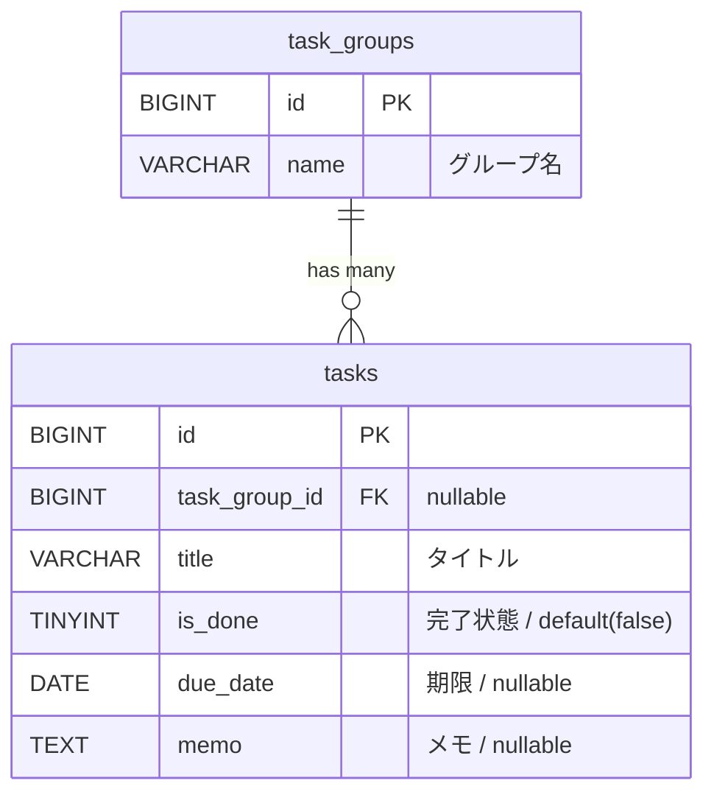

# todo-laravel

## 基本機能
<table>
  <tr>
    <td>タスクの 新規追加 / 編集 / 削除 / 一覧表示</td>
  </tr>
  <tr>
    <td>タスクの 完了・未完了の個別切り替え / 一括切り替え</td>
  </tr>
  <tr>
    <td>フィルター表示（すべて / 未完了 / 完了済み）</td>
  </tr>
  <tr>
    <td>完了済みタスクの一括削除</td>
  </tr>
</table>

## DB

※timestamps (created_at, updated_at) を含む

## バリデーション
### TaskGroup

```php
// TaskGroupRequest.php
'name' => 'required|max:255'
```

### Task
```php
// TaskRequest.php
'title'=> 'required|max:255',
'due_date' => 'nullable|date',
'memo' => 'nullable|max:1000',
'task_group_id' => 'nullable|exists:task_groups,id'
```

## ルーティング
| Path | リクエスト | 内容 |
| :--- | :--- | :--- |
| /task-groups | GET | グループ一覧表示 |
| /task-groups | POST | グループ新規作成 |
| /task-groups/{task-group} | GET | グループ詳細（タスク一覧） |
| /task-groups/{task-group} | PUT | グループ編集 |
| /task-groups/{task-group} | DELETE | グループ削除 |
| /task-groups/{task-group}/edit | GET | グループ編集画面 |
| /tasks | GET | タスク一覧表示 |
| /tasks | POST | タスク新規追加 |
| /tasks/{task} | PUT | タスク編集 |
| /tasks/{task} | DELETE | タスク削除 |
| /tasks/mark-all-done | PATCH | 一括完了 |
| /tasks/mark-all-undone | PATCH | 一括未完了 |
| /tasks/completed | DELETE | 完了タスクの一括削除 |
| /tasks/{task}/toggle | PATCH | 完了 / 未完了 |
| /tasks/{task}/edit | GET | タスク編集画面（→ モーダル）|
